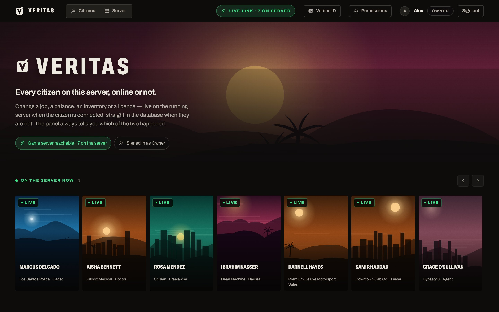
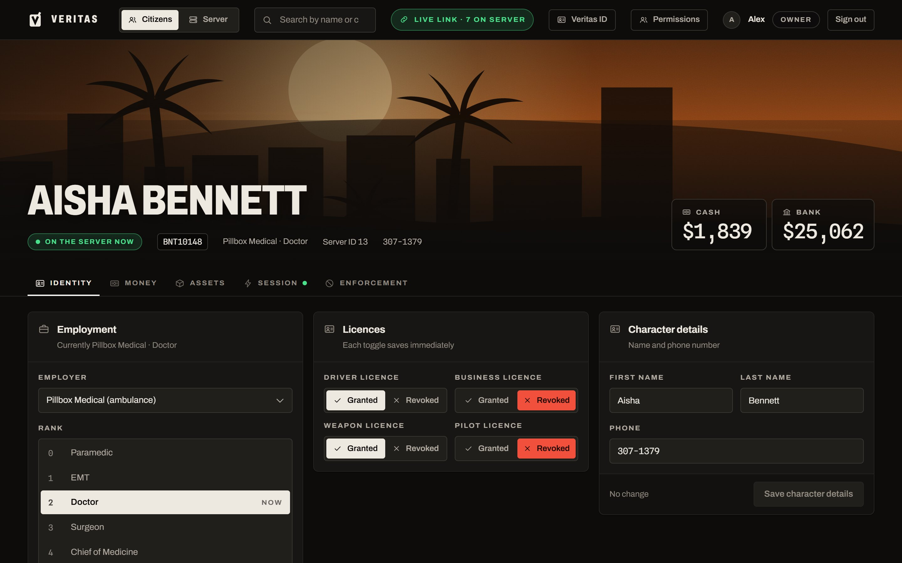
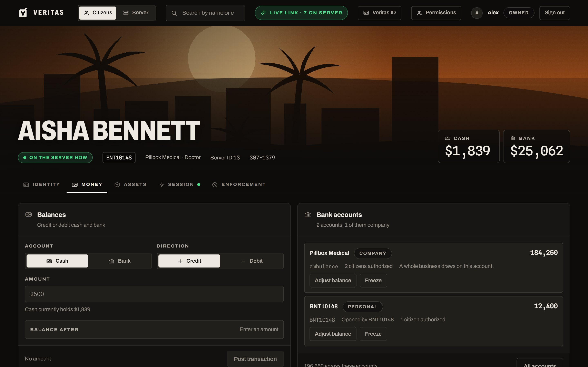
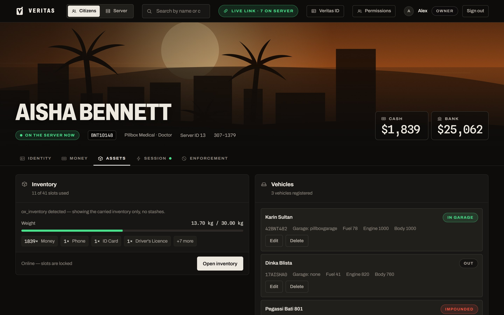
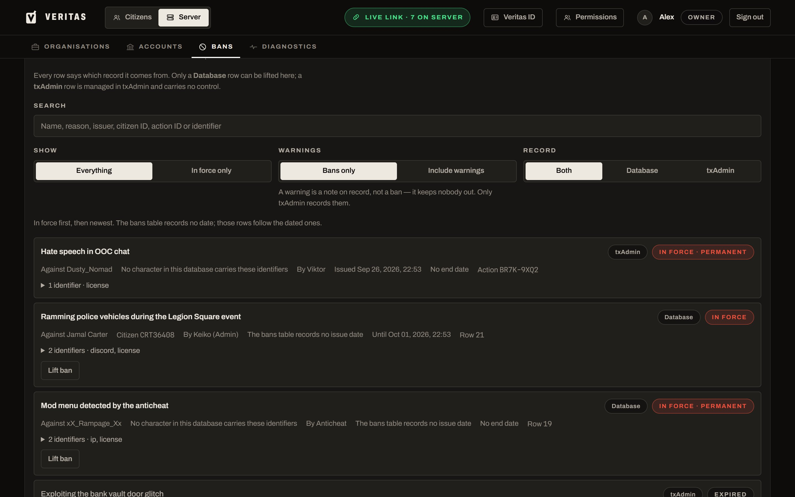
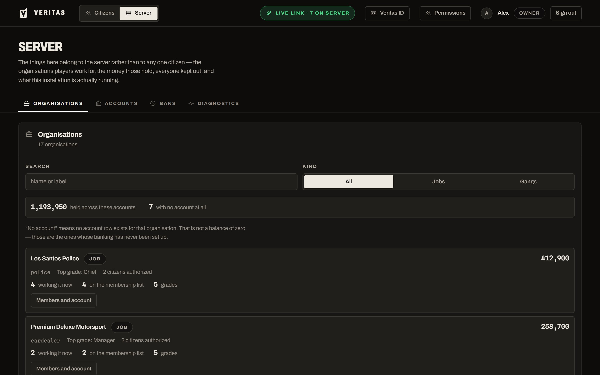
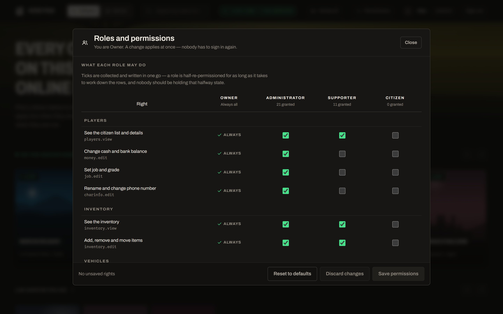
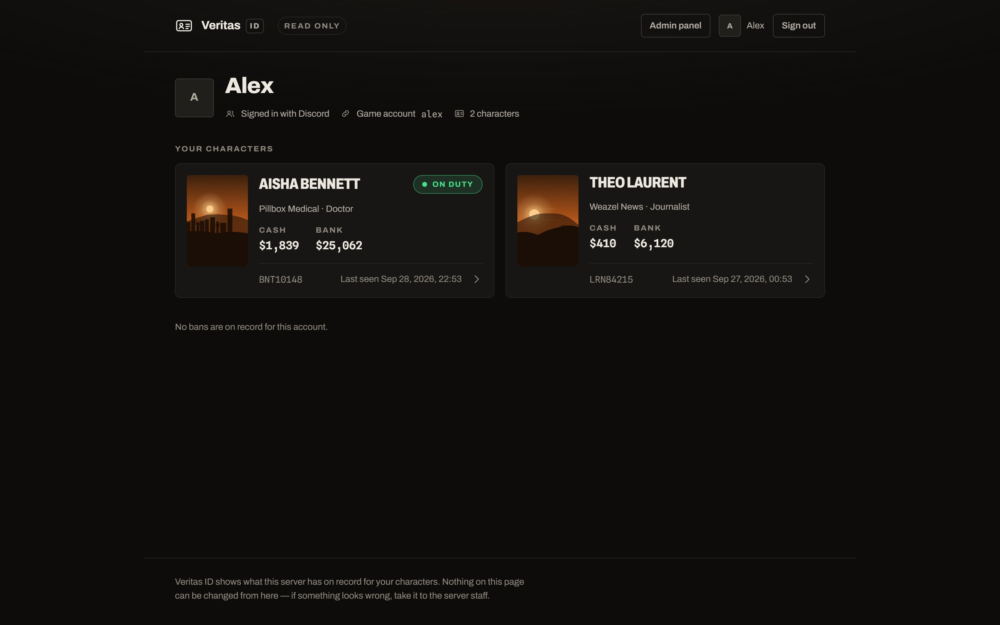
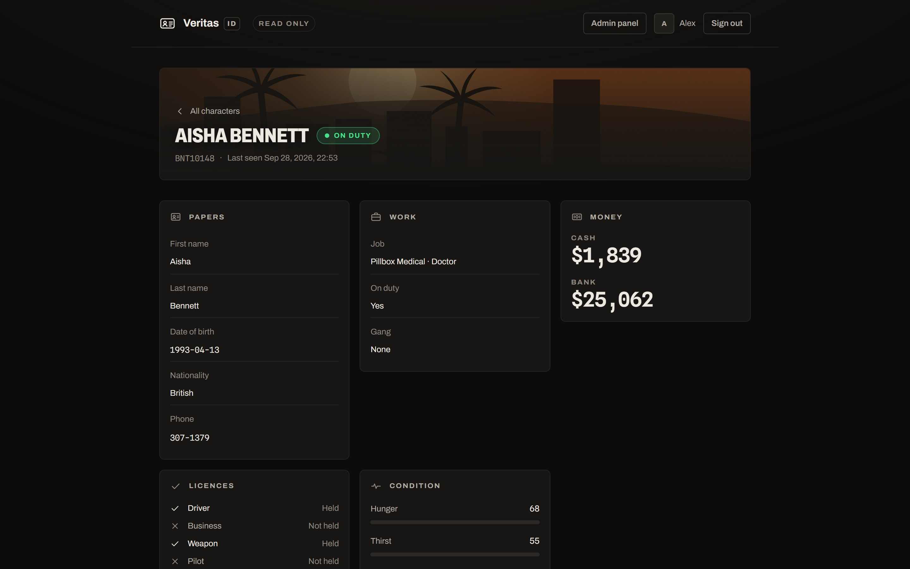

# Veritas

A web admin panel for FiveM roleplay servers. Staff find any character, online or not, and change their job, money, inventory, vehicles, licences or bans from the browser. Players get **Veritas ID**, a read-only page where they can look up their own characters.



## What it is for

Most in-game admin menus only reach players who are connected. Editing the database by hand reaches everyone, but a running server holds its own copy of an online player and overwrites the change at the next save.

Veritas does both, and picks per change:

- **Citizen online:** the change goes through the `veritas` bridge resource and applies live, in the running session.
- **Citizen offline:** the change is written straight to their row in the database.

Every change reports which of the two happened, so staff never have to guess whether a fix landed.

Typical uses:

- A player lost money or an item to a bug. Find them, credit it back, done, whether they are still in the city or already logged off.
- Promote someone, hand out a licence, or move a car out of the impound before an event.
- See who is banned and why, including txAdmin bans against identifiers that have no character in the database.
- Let players check their own characters, balances, vehicles and ban record without opening a ticket.

## A tour

### Citizens

Search by name or citizen ID. Anyone on the server right now sits at the top, and everyone else is grouped by employer. Picking a citizen opens their record in five sections.



- **Identity:** job and rank, job and gang memberships, licences, name and phone number.
- **Money:** credit or debit cash and bank, and adjust or freeze the bank accounts they can use, company accounts included.
- **Assets:** the carried inventory, by slot and weight, and owned vehicles with plate, garage, fuel and damage.
- **Session:** kick, revive, heal, teleport or message a connected player. Hunger, thirst, stress, armour and jail time can be changed here too.
- **Enforcement:** ban or unban them, and see the bans already against them.

| Money | Assets |
|---|---|
|  |  |

### Server

Things that belong to the server rather than to one citizen.

- **Organisations:** every job and gang, its members, rank structure and company balance.
- **Accounts:** every bank account on the server, personal and company.
- **Bans:** the game database's `bans` table and txAdmin's own ban record, merged into one searchable list. Each row says where it comes from, and only database bans can be lifted from the panel.
- **Diagnostics:** which framework and schema this installation runs on, and whether the bridge answers.



### Roles and permissions

Staff sign in with Discord. Each person gets a role, either by their Discord account or by a role they hold in your Discord server, and the owner decides in the panel what each role may do. Changes apply immediately, without anyone signing in again.

Owner, Administrator, Supporter and Citizen ship by default. Roles can be renamed, reordered, added and deleted, and the ranking decides which role wins when someone matches two. The owner always keeps every right, so the panel cannot lock its own owner out.

| Organisations | Roles and permissions |
|---|---|
|  |  |

### Veritas ID, for players

Players sign in with the same Discord account they play with, at `/id`. They see only their own characters: papers, job, money, licences, condition, inventory, vehicles, and any bans on their account. Nothing on these pages can be changed.

| Your characters | One character |
|---|---|
|  |  |

> The screenshots show the current build with made-up demo characters. No real player data is pictured.

## Frameworks

The `veritas` resource detects the core at startup: **Qbox**, **QBCore** or **ESX**. For anything else, `veritas/bridge/custom.lua` is where you teach it a new framework or add routes of your own. The panel reads the matching database schema directly.

Some parts depend on specific tables and switch themselves off, with a note, where those tables do not exist:

| Feature | Needs |
|---|---|
| Job and gang memberships | `player_groups` (Qbox) |
| Bank accounts, company balances | `bank_accounts_new` (qbx_banking) |
| Inventory | ox_inventory or the QBCore inventory format |
| Veritas ID | The Qbox `users` / `players` tables, linked by Discord ID |
| txAdmin bans | txAdmin's `playersDB.json` beside the server (read-only) |

## How it is built

```
backend/     Node.js + Express. Reads and writes the game database (MySQL),
             talks to the running server through the bridge, and serves the panel.
frontend/    React + Vite. Built into frontend/dist, which the backend serves.
veritas/     The FiveM resource: the bridge into the running game.
deploy/      update.sh, for updating a server install with git pull.
```

The three parts are deployed together. The backend and the panel share one port, so there is only one address to secure.

## Setting it up

You need Node.js 20.19 or newer (22 LTS recommended), access to the MySQL/MariaDB database your FiveM server uses, and a Discord application for sign-in.

1. **Clone the repo outside `resources/`**, then link or copy `veritas/` into your server's resources (for example `resources/[local]/veritas`).
2. **Configure the bridge.** Copy `veritas/config.lua.example` to `veritas/config.lua` and set `Config.Token` to a long random secret (`openssl rand -hex 32`). Set `Config.RequireTokenEverywhere = true` once setup works, because the bridge listens on the FiveM HTTP port, which is public on most servers. Add `ensure veritas` to `server.cfg`.
3. **Configure the backend.** Copy `backend/.env.example` to `backend/.env` and fill it in. Every setting is explained in that file. The ones you cannot skip:
   - `DB_*`: the database the game server writes to.
   - `FIVEM_JSON_PATH` and `FIVEM_API_URL`: where the `veritas` resource lives and how to reach it.
   - `BRIDGE_TOKEN`: the same value as `Config.Token`.
   - `DISCORD_*`: the OAuth app, with `DISCORD_REDIRECT_URI` also listed under Redirects in the Discord Developer Portal.
   - `DISCORD_OWNER_IDS` or `DISCORD_ROLE_OWNER`: at least one owner.
   - `SESSION_SECRET`: signs the login cookie.
4. **Install and build.**
   ```bash
   cd backend  && npm ci
   cd ../frontend && npm ci && npm run build
   ```
5. **Start it.**
   ```bash
   cd backend && npm start
   ```
   The panel is at `http://<host>:3001`, and Veritas ID at `/id`. Put it behind HTTPS (Caddy, nginx) before opening it to the internet, and then set `COOKIE_SECURE=true`.

> Without Discord configured the panel still starts, but anyone who can reach the port can use it, and it says so on every page.

### Updating

On a server install, `deploy/update.sh` pulls `main`, reinstalls, rebuilds the panel and restarts `veritas.service`. Your `.env`, `config.lua` and saved roles are gitignored and stay untouched. Run `ensure veritas` in the server console when the bridge changed.

## Development

```bash
cd backend  && npm run dev   # API on :3001, restarts on change
cd frontend && npm run dev   # panel on :5173, proxies /api to :3001
cd backend  && npm test      # the backend test suite
```

For sign-in during development, set `PANEL_ORIGIN=http://localhost:5173` in `backend/.env`.

[BACKEND.md](BACKEND.md) is the handbook for working on the backend: how it is put together, the rules it must not break, and what has gone wrong before.
